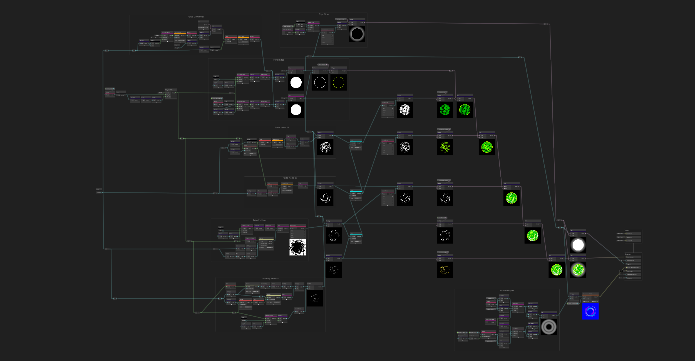
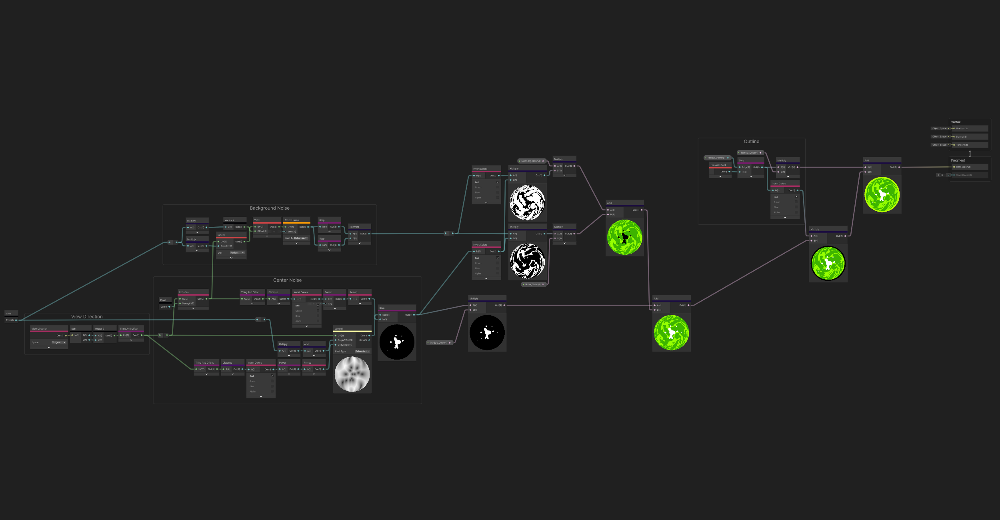

# Shader Technical Breakdown

This document provides an in-depth look at the shader techniques used to create the Rick & Morty portal effect.

## Portal Shader (`R&M_Portal_S`)

### Overview

The portal shader creates a swirling, animated vortex effect entirely through procedural generation. No textures are used—all visual elements are computed in real-time using mathematical functions and noise algorithms.

### Node Graph Structure



### Key Techniques

#### 1. Polar Coordinate Conversion

The swirl effect begins by converting standard UV coordinates to polar coordinates:

```
Polar UV:
  - Angle (θ) = atan2(uv.y - 0.5, uv.x - 0.5)
  - Radius (r) = distance(uv, float2(0.5, 0.5))
```

This allows us to manipulate the texture space in radial patterns.

#### 2. Animated Swirl Pattern

The swirling motion is achieved by offsetting the angle based on time and radius:

```
Swirl Angle = θ + (Time * SwirlSpeed) + (r * TwistAmount)
```

The radius-based twist creates the characteristic spiral where inner regions rotate faster than outer regions.

#### 3. Layered Noise

Multiple noise layers create the organic, fluid appearance:

| Layer | Noise Type | Scale | Purpose |
|-------|------------|-------|---------|
| Base | Gradient Noise | Large | Overall shape variation |
| Detail | Voronoi | Medium | Cell-like structures |
| Micro | Simple Noise | Small | Fine detail and breakup |

#### 4. Edge Ring / Fresnel Glow

The glowing outer edge uses a combination of:
- Radial gradient (1 - smoothstep for falloff)
- Fresnel effect for view-angle dependent glow
- HDR color multiplication for bloom compatibility

#### 5. Color Mapping

The final color is computed by mapping noise values to a gradient between the base and secondary colors, then multiplying by emission intensity for HDR output.

---

## Projectile Shader (`Portal_Projectile_S`)

### Overview

The projectile shader faces a unique challenge: maintaining a 2D animated look on a 3D sphere that rotates freely in world space.

### Node Graph Structure



### View-Space Texture Projection

The key innovation is projecting the noise pattern in view space rather than object space:

#### Traditional Object-Space UV (Problem)
```
When sphere rotates → UV coordinates rotate → Pattern spins unnaturally
```

#### View-Space Projection (Solution)
```
1. Transform vertex position to view space
2. Use view-space XY as UV coordinates
3. Pattern always faces camera regardless of object rotation
```

---

## Performance Considerations

### Shader Complexity

Both shaders run entirely in the fragment shader with no geometry manipulation:

| Operation | Approximate Cost |
|-----------|------------------|
| Polar conversion | Low |
| Gradient Noise (per layer) | Medium |
| Voronoi Noise | Medium-High |
| Color operations | Low |
