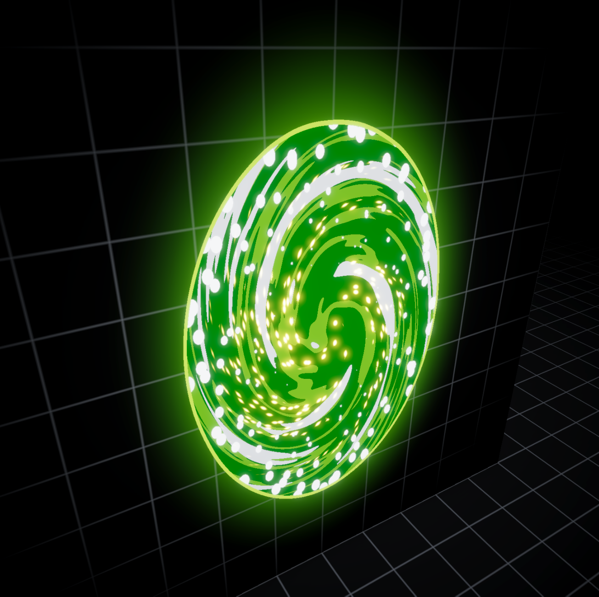

# Rick & Morty Portal Shader

A fully procedural recreation of the iconic portal effect from Rick and Morty, built in Unity using Shader Graph. Features a projectile-to-portal system with no static textures and all patterns are generated in real-time.

## Features

- **100% Procedural** - No baked textures; swirling patterns generated via noise and polar coordinates
- **View-Space Projection** - Projectile orb maintains 2D animation aesthetic regardless of 3D rotation
- **Customizable Parameters** - Easy adjustment of colors, speed, scale, and glow intensity
- **URP Compatible** - Built for Universal Render Pipeline

## Preview

| Portal Effect | Projectile Orb |
|:-------------:|:--------------:|
|  |  |

## Requirements

- Unity 2021.3 LTS or newer
- Universal Render Pipeline (URP)
- Shader Graph package

## Installation

### Option 1: Unity Package Manager (Git URL)
1. Open **Window → Package Manager**
2. Click the **+** button → **Add package from git URL**
3. Enter: `https://github.com/RatanSoni/Rick-Morty-Portal-Shader.git`

### Option 2: Manual Installation
1. Download or clone this repository
2. Copy the `Shaders` and `Materials` folders into your project's `Assets` directory

## Shader Architecture

### Portal Shader (`R&M_Portal_S`)

The portal effect is achieved through layered procedural techniques:

| Layer | Technique | Purpose |
|-------|-----------|---------|
| **Swirl Pattern** | Polar UV + Animated Noise | Creates the spiraling green energy |
| **Edge Ring** | Fresnel + Radial Gradient | Glowing outer boundary |
| **Inner Distortion** | Voronoi + Gradient Noise | Fluid portal interior |
| **Emission** | HDR Color × Intensity | Bloom-compatible glow |

### Projectile Shader (`Portal_Projectile_S`)

| Feature | Implementation |
|---------|----------------|
| **View-Space Projection** | `TransformWorldToView` → UV mapping |
| **Consistent Facing** | Pattern always faces camera regardless of rotation |
| **Energy Core** | Same noise system as portal, scaled for spherical mapping |

The view-space projection ensures the swirling energy pattern always faces the player, creating the illusion of a volumetric portal core rather than a spinning textured ball.

## Material Parameters

### Portal Material

| Parameter | Type | Description |
|-----------|------|-------------|
| `_BaseColor` | Color (HDR) | Primary portal color |
| `_SecondaryColor` | Color (HDR) | Swirl accent color |
| `_SwirlSpeed` | Float | Rotation speed of the pattern |
| `_NoiseScale` | Float | Scale of the procedural noise |
| `_EdgeWidth` | Float | Thickness of the glowing rim |
| `_EmissionIntensity` | Float | Glow strength (affects bloom) |

### Projectile Material

| Parameter | Type | Description |
|-----------|------|-------------|
| `_CoreColor` | Color (HDR) | Central energy color |
| `_GlowColor` | Color (HDR) | Outer glow color |
| `_PulseSpeed` | Float | Energy pulse frequency |

## Usage

1. Create a quad or plane mesh for the portal
2. Apply `M_Portal` material
3. For projectiles, apply `M_PortalProjectile` to a sphere mesh
4. Adjust material parameters to taste
5. Ensure your URP asset has HDR and Bloom enabled for best results

## Performance Notes

- All calculations are per-pixel; complexity scales with screen coverage
- Noise functions use gradient noise (cheaper than Voronoi for large areas)
- Consider reduced material instances for distant portals

## License

MIT License - See [LICENSE](LICENSE) for details.

## Author

**Ratan Soni**  
[Portfolio](https://ratandsoni.weebly.com) • [GitHub](https://github.com/RatanSoni)

---

*This project is a fan-made technical recreation for educational purposes and is not affiliated with or endorsed by Adult Swim or the creators of Rick and Morty.*
